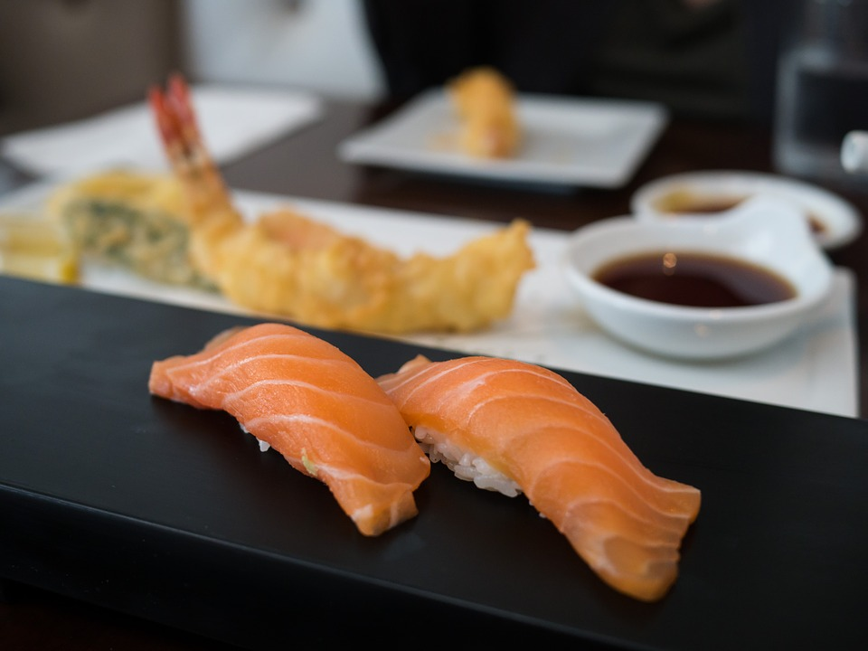

# auto_counttable_maker　

[idep](http://bioinformatics.sdstate.edu/idep/)のinputとしてcount tableをexperiment matrix（tpTregTconv_rnaseq_experiment_table.csv）から自動でつくる。salmonを用いる。

## 注意

MAX_SPOT_IDが0以外の値のときはテストモード（fastq-dumpでダウンロードするread数)。デフォルトは現在全リード取得。時間がかかるので、テストの場合は各自`MakeCountTable_Illumina_trimgalore_SRR.sh`の中を変更する。
optionが実装されたときにtest modeについてもオプション立てれるようにする予定。

## Usage

```bash
$ bash MakeCountTable_Illumina_trimgalore_SRR.sh experiment_table.csv mouse
```

args
1. experiment matrix(csv)
2. reference(human or mouse)

experiment matrixはカンマ区切りで（csv形式）

|  name  |  SRR or fastq  |  Layout  | condition1 | ... |
| ---- | ---- | - | - | - |
|  Treg_LN_1  | SRR5385247 | SE | Treg | ...|
|  Treg_LN_2  |  SRR5385248  | SE  | Treg | ... |


nameはアンダーバー区切りでcondition、replicateをつなげて書く。
前3列は必須。

- Illumina用 : trimmomatic -> trim_galoreに切り替えた。
- Ion S5用: SEしか無い。trimmomaticではなくfastx-toolsを使う。adapterはNoneを入れておく。(test : [DRP003376](https://trace.ncbi.nlm.nih.gov/Traces/sra/?study=DRP003376))

### 仕様について

- outputは**scaledTPM** (see. [Soneson, C., Love, M. I. & Robinson, M. D. Differential analyses for RNA-seq: transcript-level estimates improve gene-level inferences. F1000Research 4, 1521 (2015).](https://f1000research.com/articles/4-1521/v2))。
- GCbiasについて、salmonで`--gcBias`を追加した。GCbiasのRNAseqにおける影響に関しては[Mike Love's blog :
RNA-seq fragment sequence bias](https://mikelove.wordpress.com/2016/09/26/rna-seq-fragment-sequence-bias/)。
- validateMappings optionを採用。（alignment-base modeでは使えない。）詳しくは[salmon Frequently Asked Questions](https://combine-lab.github.io/salmon/faq/)。

## Install

dockerかudocker(v1.1.3)をインストール済みであること。
もしくは、すべてのソフトを手動でインストールして、MakeCountTable*.shの`RUNINDOCKER=1`に設定する。
shell scriptなのでpathを通すだけ。以下は一例。

```bash
$ git clone https://github.com/yyoshiaki/auto_counttable_maker.git
$ cd auto_counttable_maker
$ echo "export PATH=$PATH:$PWD" >> ~/.bashrc
$ source ~/.bashrc
```

## test

### Illumina trim_galore ver.

#### SE

```bash
$ cd test/Illumina_SE && bash ../../MakeCountTable_Illumina_trimgalore_SRR.sh Illumina_SE_SRR.csv mouse
```

#### PE

```bash
$ cd test/Illumina_PE && bash ../../MakeCountTable_Illumina_trimgalore_SRR.sh Illumina_PE_SRR.csv mouse
```

### Ion (ThermoFisher)

```bash
$ cd test/Ion && bash ../../MakeCountTable_Ion_SRR.sh Ion_SRR.csv mouse
```

### Macのひと

salmonがmacで走らない問題だが、[DBCLS大田さん](https://github.com/inutano)に解決していただいた。macではdefaultで2Gbしかメモリをdockerに振っていないことが原因らしい。写真のように、8Gb等大きめのメモリ量を割り振って、Apply & Restartすると解決する。


## やること

[issue](https://github.com/yyoshiaki/auto_counttable_maker/issues)を参照のこと。

フォルダのパーミッションを777にしてrunした後755にしているが、果たして大丈夫？

## やったこと

- udockerの対応
- 生物種の判別(アナログ)
- gtf, transcript file をGENCODEから
- salmon
- trimmomatic
- trim_galore!
- tximport
- fastxtools(Ion用)
- fastqかSRRの判別(マニュアル)
- salmon gcbias correctionの導入
- salomn validateMappings
- pigz(gzipのマルチスレッド版)
- fasterq-dump

## legacy

trimmomaticを使ったトリミングを用いたフローは`./legacy`に移動しました。

## 開発戦略

今はまだ完成とは言えないので各自

Fork -> Pull Request into master

という流れだが、ある程度固まったら、Development branchを設けるので、そこにPRして貰う予定。

## 参考

- [biocontainers : SNP-calling](http://biocontainers.pro/docs/containers-examples/SNP-Calling/)
- [idep](http://bioinformatics.sdstate.edu/idep/)
- [GENCODE](https://www.gencodegenes.org/)
- [salmon](https://combine-lab.github.io/salmon/getting_started/)
