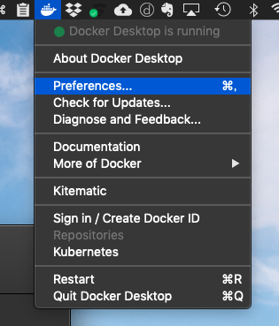
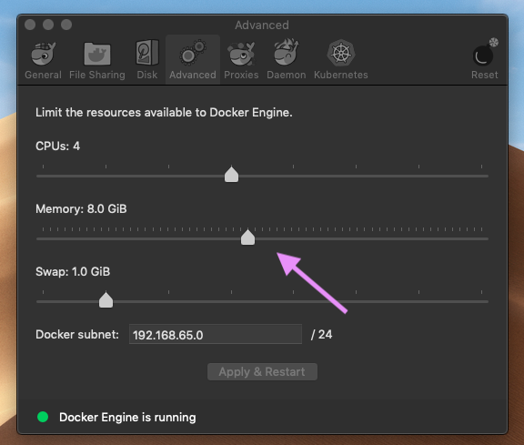
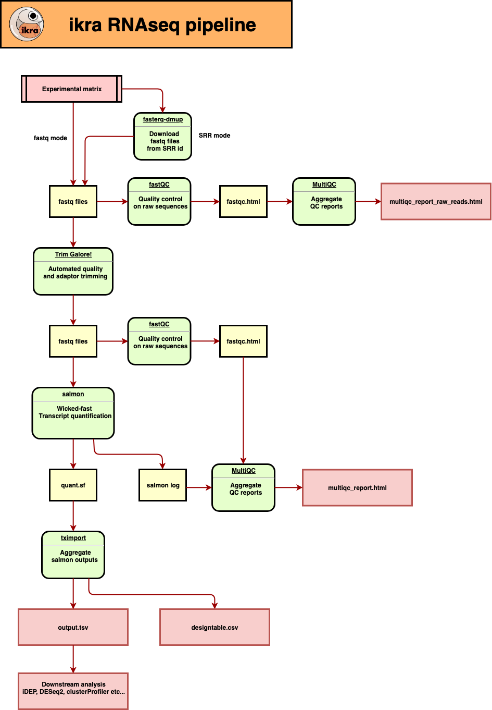

[](https://doi.org/10.5281/zenodo.3352573)

# ikra v1.2.3 -RNAseq pipeline centered on Salmon-

A gene expression table (gene × sample) is automatically created from the experiment matrix. The output can be used as an input of [idep](http://bioinformatics.sdstate.edu/idep/). Ikra is an RNAseq pipeline centered on [salmon](https://combine-lab.github.io/salmon/).


## [日本語ドキュメントはこちら](./README_ja.md)

## Note that sra-tools has to be installed locally. This is up to NCBI's tool upgrade. Please install sra-tools (>=2.10.7).

## Usage

```
Usage: ikra.sh experiment_table.csv species \
        [--test, --fastq, --help, --without-docker, --udocker --protein-coding] \
        [--threads [VALUE]][--output [VALUE]]\
        [--suffix_PE_1 [VALUE]][--suffix_PE_2 [VALUE]]
  args
    1.experiment matrix(csv)
    2.reference(human or mouse)

Options:
  --test  test mode(MAX_SPOT_ID=100000).(dafault : False)
  --fastq use fastq files instead of SRRid. The extension must be foo.fastq.gz (default : False)
  -u, --udocker
  -w, --without-docker
  -pc, --protein-coding use protein coding transcripts instead of comprehensive transcripts. (default : True)
  -ct, --comprehensive-transcripts use comprehensive transcripts instead of protein coding transcripts. (default : False) 
  -t, --threads
  -o, --output  output file. (default : output.tsv)
  -l, --log  log file. (default : ikra.log)
  -s1, --suffix_PE_1    suffix for PE fastq files. (default : _1.fastq.gz)
  -s2, --suffix_PE_2    suffix for PE fastq files. (default : _2.fastq.gz)
  -h, --help    Show usage.
  -v, --version Show version.
  -r, --remove-intermediates Remove intermediate files
```

- **test option** limits the number of reads to 100,000 in each sample.
- **udocker mode** is for server environments that can only use User privileges. For more information [https://github.com/indigo-dc/udocker](https://github.com/indigo-dc/udocker).
- **without-docker mode** works with all tools installed. Not recommended.
- **protein-coding mode** restricts genes to protein coding genes only.
- **threads**
- **output** is `output.tsv` by default.  
**experiment matrix** should be separated by commas (csv format).

**SRR mode**

|  name  |  SRR |  Layout  | condition1 (optional) | ... |
| ---- | ---- | - | - | - |
|  Treg_LN_1  | SRR5385247 | SE | Treg | ...|
|  Treg_LN_2  |  SRR5385248  | SE  | Treg | ... |

**fastq mode**

|  name  |  fastq(PREFIX) |  Layout  | condition1 (optional) | ... |
| ---- | ---- | - | - | - |
|  Treg_LN_1  | hoge/SRR5385247 | SE | Treg | ...|
|  Treg_LN_2  |  hoge/SRR5385248  | SE  | Treg | ... |

- Denote names by connecting conditions and replicates with underscores. See [idep's Naming convention](https://idepsite.wordpress.com/data-format/) in detail.
- The first three columns are required.
- If you want to use your own fastq file, add `--fastq` option. Ikra supports only `.fq`, `.fq.gz`, `.fastq` and `fastq.gz`.
- fastq file specifies path excluding `fastq.gz` or `_1.fastq.gz` and `_2.fastq.gz`. For example, `hoge/SRR5385247.fastq.gz` is described as `hoge/SRR5385247`.
- If suffix is not `_1.fastq.gz` or `_2.fastq.gz`, add -s1 and -s2 options.
- It is impossible for docker to specify a hierarchy above the execution directory, such as `../fq/**.fastq.gz`, but it can be avoided by pasting a symbolic link.
[bonohu blog](https://bonohu.github.io/running-ikra.html)

### Output

- output.tsv(scaledTPM)
- multiqc_report.html : including fastQC reports and mapping rate of salmon(mapping rate for transcripts)

**output sample**

|  |  Treg_LN_1 |  Treg_LN_2  |
| ---- | ---- | - |
|  0610005C13Rik | 0 | 0 |
|  0610006L08Rik | 0 | 1 |
|  0610009B22Rik | 4 | 10 |
| ... | | |

### Specification

- output is **scaledTPM** (see. [Soneson, C., Love, M. I. & Robinson, M. D. Differential analyses for RNA-seq: transcript-level estimates improve gene-level inferences. F1000Research 4, 1521 (2015).](https://f1000research.com/articles/4-1521/v2))。
- `—-gcBias` option was added on salmon. You can refer to [Mike Love's blog :
RNA-seq fragment sequence bias](https://mikelove.wordpress.com/2016/09/26/rna-seq-fragment-sequence-bias/).
- `--validateMappings` flag was also adopted. (You can’t use it while using alignment-base mode.) Please see [salmon Frequently Asked Questions](https://combine-lab.github.io/salmon/faq/) for further details.
- The reference for human is GENCODE Release 31 (GRCh38.p12), and that for mouse is GENCODE Release M22 (GRCm38.p6)

## Major bugs that have fixed

### tximport_R.R 2019/04/30 

A serious bug was reported in the `tximport_R.R` and fixed. In the older version, Salmon's output and multiqc reports were correct and sometimes `output.tsv` were disturbed. Please update Ikra to the latest version. If you are using the old version(<1.1.1), please update and re-run ikra. We apologize for the inconvenience.

### fasterq-dump error 2019/09/21

A bug has been reported that stops processing due to the following error in sra-tools.
`docker: Error response from daemon: OCI runtime create failed: container_linux.go:345: starting container process caused "exec: \"fasterq-dump\": executable file not found in $PATH": unknown.`
The latest version has already been corrected, so if you encounter the same error, please update to the latest version.

## Install

All you need is `git clone` ikra, and install docker or udocker(v1.1.3). No need for installing plenty of softwares! If you don’t want to use docker (or udocker), you must install all softwares by yourself and use `—-without-docker` option.

```bash
$ git clone https://github.com/yyoshiaki/ikra.git
```

**if you use SRR mode, install [sra-toolkit](https://github.com/ncbi/sra-tools/wiki) locally.**


## Upgrade

```bash
$ git pull origin master
```

## Version

```bash 
 $ bash ikra.sh --version
 ...
 ikra v1.2.3 -RNAseq pipeline centered on Salmon-
 ...
```

### Version of each tool

- sra-tools : > 2.10.7
- FastQC 0.11.5
- MultiQC : 1.4
- Trim Galore! : 0.6.3
- Salmon : 0.14.0
- tximport : 1.6.0

## Test

### SE

**SRR mode**

```bash
$ cd test/Illumina_SE && bash ../../ikra.sh Illumina_SE_SRR.csv mouse --test -t 10
```

**fastq mode**

You can execute it after you execute SRR mode. (That is because you don’t have fastq files.)

```bash
$ cd test/Illumina_SE && bash ../../ikra.sh Illumina_SE_fastq.csv mouse --fastq -t 10
```

### PE

**SRR mode**

```bash
$ cd test/Illumina_PE && bash ../../ikra.sh Illumina_PE_SRR.csv mouse --test -t 10
```

**fastq mode**

You can execute it after you execute SRR mode. (That is because you don’t have fastq files.)


```bash
$ cd test/Illumina_PE && bash ../../ikra.sh Illumina_PE_fastq.csv mouse --fastq -t 10
```

### test all (for developers)

```bash
cd test && bash test.sh && bash test.full.sh
```


## For Mac Users

[Dr.Ota(DBCLS)](https://github.com/inutano) solved the problem that salmon doesn’t work on Mac. The cause of the problem is that Docker is allocated only 2GB by default on Mac. The problem will be solved by allocating sufficient memory space(>=8Gb) for Docker, and applying and restarting Docker.




## ikra pipeline



## Tips

You can find SRR data so quickly in [http://sra.dbcls.jp/](http://sra.dbcls.jp/index.html)


## Q&A

- In exporting output.tsv to iDEP, which data type should I select?

When iDEP reads output.tsv, please put a check to `Read counts data`.

## Issue

Please refer to [issue](https://github.com/yyoshiaki/ikra/issues)

## Releases

Please refer to [Relases](https://github.com/yyoshiaki/ikra/releases)

- add support for udocker
- add setting of species
- gtf and transcript file from GENCODE
- salmon
- trimmomatic(legacy)
- trim_galore!
- tximport
- fastxtools(for Ion)
- judging fastq or SRR(manual)
- introduce "salmon gcbias correction"
- salomn validateMappings
- pigz(multithread version of gzip)
- fasterq-dump
- cwl development is in progress
- rename to "ikra"
- protein coding option

## Legacy

Moved the flow using trimmomatic to `./legacy`

##  Reference

- [biocontainers : SNP-calling](http://biocontainers.pro/docs/containers-examples/SNP-Calling/)
- [idep](http://bioinformatics.sdstate.edu/idep/)
- [GENCODE](https://www.gencodegenes.org/)
- [salmon](https://combine-lab.github.io/salmon/getting_started/)

## Development of cwl ver.

2019/03/22 https://youtu.be/weJrq5QNt1M We tried developing it because Mr.Michael visited Japan.  For now, cwlnized trim_galore and salmon in PE.

```
cd test/cwl_PE && bash test.sh
```

## sorce and reference ー cwl_tools

- https://github.com/pitagora-galaxy/cwl
- https://github.com/roryk/salmon-cwl

## Citation

Hiraoka, Y., Yamada, K., Kawasaki, Y., Hirose, H., Matsumoto, Y., Ishikawa, K., & Yasumizu, Y. (2019). ikra : RNAseq pipeline centered on Salmon. https://doi.org/10.5281/ZENODO.3352573

